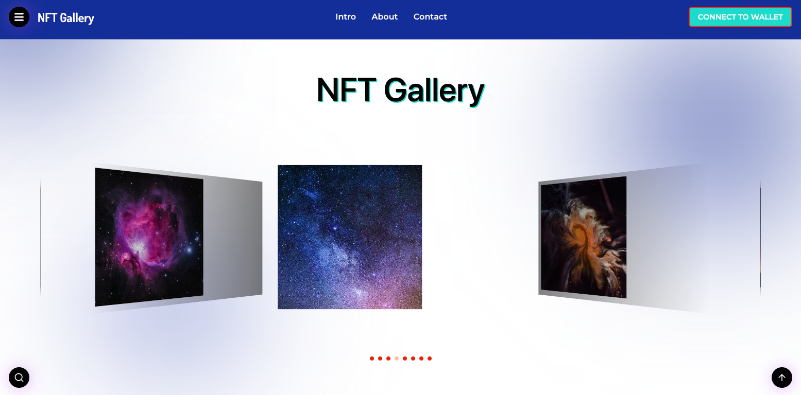
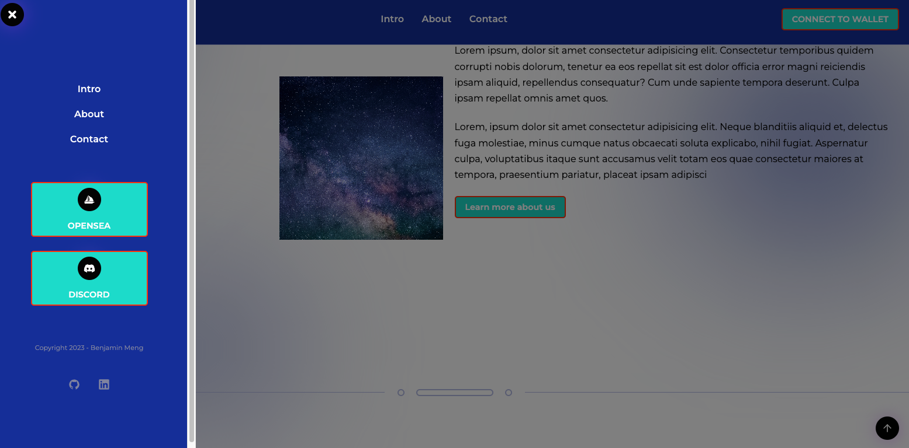
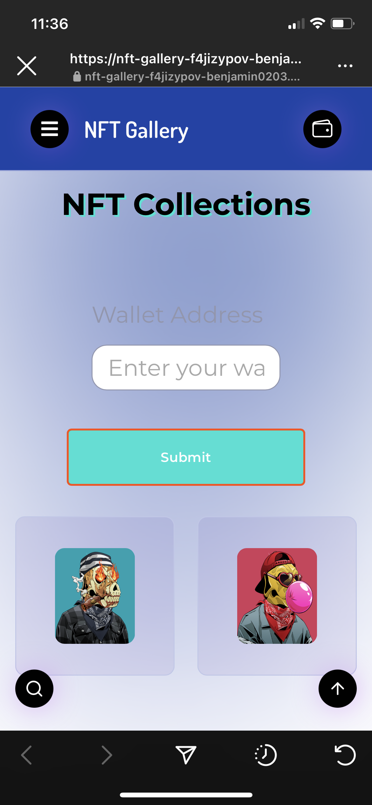
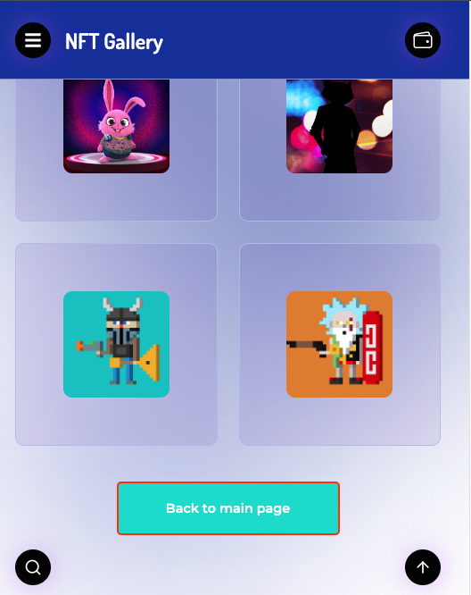

# NFT Gallery
---
## Intro

NTF Gallery is a modern front-end web application designed for showcasing NFT arts and visual content in a stylish and user-friendly manner. Developed using the latest web technologies, including Next.js and Styled-Components, NTF Gallery provides a seamless user experience on all devices, including mobile devices.
You can view the website by clicking this **[link](https://nft-gallery-f4jizypov-benjamin0203.vercel.app/)**.

---
## Key Features

* Dynamic image display, allowing you to navigate between images from your gallery
* Mobile-friendly design, ensuring a great user experience on all devices.
* Clean, modern user interface using Styled-Components for consistent styling across the app
* Fast and efficient performance, thanks to the power of Next.js

---
## Showcase

---
## Set up
To get started with NTF Gallery, simply clone the repository to your local machine and run `npm install` to install all necessary dependencies. Then, start the development server by running `npm run dev` and navigate to http://localhost:3000 in your web browser.

---
## Tech Stack

- Next.js
- Styled Components
- axios
- Swiper
- zod
